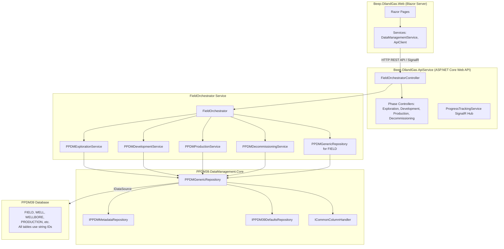
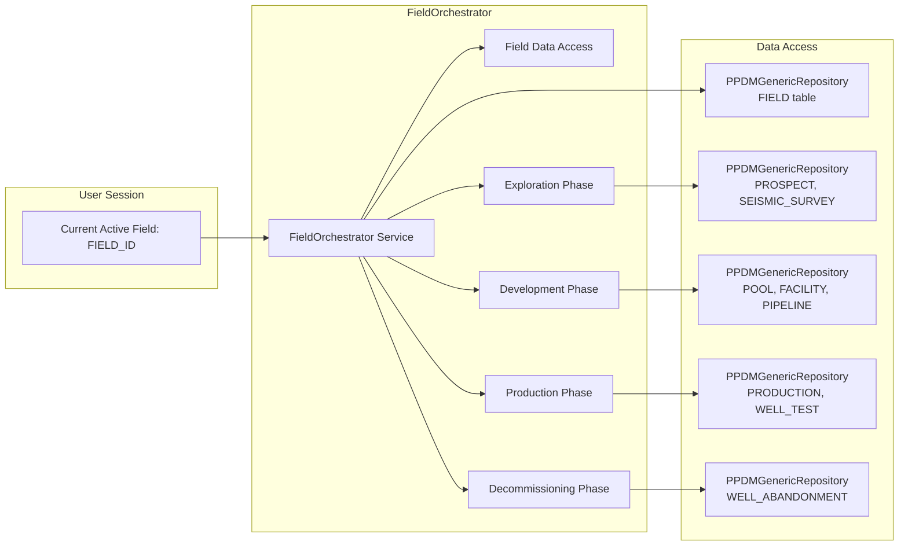
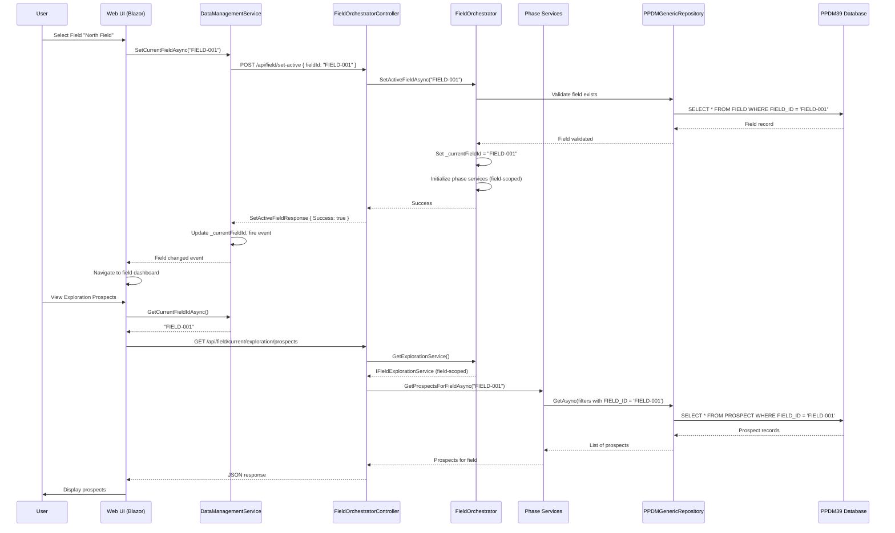

# Comprehensive Oil Field Lifecycle Implementation Plan

## Architecture Foundation

### Data Persistence Principle

**All data is stored in the PPDM39 database**. There are no separate databases for different phases or features. All lifecycle data (Exploration, Development, Production, Decommissioning) exists in the same PPDM39 database schema.**All DTOs and Model Classes** must be placed in the `Beep.OilandGas.PPDM39` project:

- DTOs: `Beep.OilandGas.PPDM39/Core/DTOs/` or `Beep.OilandGas.PPDM39/DTOs/`
- Interfaces: `Beep.OilandGas.PPDM39/Core/Interfaces/`
- Models: `Beep.OilandGas.PPDM39/Models/` (if needed for non-PPDM-table entities)

The implementation uses a three-layer architecture with **FieldOrchestrator** as the central coordinator managing a single active field's complete lifecycle, and PPDMGenericRepository as the core data access abstraction:

### Layer Structure




### FieldOrchestrator: Central Lifecycle Manager

**Purpose**: Manages the complete lifecycle of a single active field, coordinating all phases (Exploration, Development, Production, Decommissioning).**Key Responsibilities**:

1. **Field Context Management**: Maintains current active field (user can switch fields)
2. **Phase Coordination**: Coordinates all lifecycle phases for the active field
3. **Unified Data Access**: Uses PPDMGenericRepository to access all field-related data
4. **Cross-Phase Queries**: Provides methods to query data across phases for the active field
5. **Field State Management**: Tracks field lifecycle phase transitions

**Interface Location**: `Beep.OilandGas.PPDM39/Core/Interfaces/IFieldOrchestrator.cs`**Implementation**: `Beep.OilandGas.PPDM39.DataManagement/Services/FieldOrchestrator.cs`

```csharp
// In Beep.OilandGas.PPDM39/Core/Interfaces/IFieldOrchestrator.cs
public interface IFieldOrchestrator
{
    string? CurrentFieldId { get; }
    Task<bool> SetActiveFieldAsync(string fieldId);
    Task<object> GetCurrentFieldAsync();
    Task<FieldLifecycleSummary> GetFieldLifecycleSummaryAsync();
    IFieldExplorationService GetExplorationService();
    IFieldDevelopmentService GetDevelopmentService();
    IFieldProductionService GetProductionService();
    IFieldDecommissioningService GetDecommissioningService();
    Task<List<object>> GetFieldWellsAsync();
    Task<FieldStatistics> GetFieldStatisticsAsync();
    Task<FieldTimeline> GetFieldTimelineAsync();
}

// In Beep.OilandGas.PPDM39.DataManagement/Services/FieldOrchestrator.cs
public class FieldOrchestrator : IFieldOrchestrator
{
    private readonly IDMEEditor _editor;
    private readonly ICommonColumnHandler _commonColumnHandler;
    private readonly IPPDM39DefaultsRepository _defaults;
    private readonly IPPDMMetadataRepository _metadata;
    private readonly string _connectionName;
    private string _currentFieldId; // Current active field ID
    
    // Phase services (injected or created on demand)
    private PPDMExplorationService _explorationService;
    private PPDMDevelopmentService _developmentService;
    private PPDMProductionService _productionService;
    private PPDMDecommissioningService _decommissioningService;
    
    // Field repository
    private PPDMGenericRepository _fieldRepository;
    
    public string CurrentFieldId => _currentFieldId;
    
    public async Task<bool> SetActiveFieldAsync(string fieldId)
    {
        // Validate field exists
        var fieldMetadata = await _metadata.GetTableMetadataAsync("FIELD");
        var entityType = Type.GetType($"Beep.OilandGas.PPDM39.Models.{fieldMetadata.EntityTypeName}");
        _fieldRepository = new PPDMGenericRepository(_editor, _commonColumnHandler, _defaults, _metadata,
            entityType, _connectionName, "FIELD");
            
        var field = await _fieldRepository.GetByIdAsync(_defaults.FormatIdForTable("FIELD", fieldId));
        if (field == null)
            return false;
            
        _currentFieldId = _defaults.FormatIdForTable("FIELD", fieldId);
        
        // Initialize phase services with field context
        _explorationService = new PPDMExplorationService(...);
        _developmentService = new PPDMDevelopmentService(...);
        _productionService = new PPDMProductionService(...);
        _decommissioningService = new PPDMDecommissioningService(...);
        
        return true;
    }
    
    public async Task<object> GetCurrentFieldAsync()
    {
        if (string.IsNullOrEmpty(_currentFieldId))
            return null;
            
        return await _fieldRepository.GetByIdAsync(_currentFieldId);
    }
    
    // Cross-phase query methods
    public async Task<FieldLifecycleSummary> GetFieldLifecycleSummaryAsync()
    {
        // Query across all phases for current field
        var field = await GetCurrentFieldAsync();
        // Get exploration data, development data, production data, decommissioning data
        // Return unified summary
    }
    
    public async Task<List<object>> GetFieldWellsAsync()
    {
        // Query all wells across all phases for current field
        // Uses PPDMGenericRepository with FIELD_ID filter
    }
    
    public async Task<FieldStatistics> GetFieldStatisticsAsync()
    {
        // Aggregate statistics across all phases for current field
        // Uses PPDMGenericRepository to query multiple tables
    }
    
    public async Task<FieldTimeline> GetFieldTimelineAsync()
    {
        // Build timeline of events across all phases for current field
        // Uses PPDMGenericRepository to query multiple tables with date fields
    }
    
    // Phase-specific access
    public IFieldExplorationService GetExplorationService() => _explorationService;
    public IFieldDevelopmentService GetDevelopmentService() => _developmentService;
    public IFieldProductionService GetProductionService() => _productionService;
    public IFieldDecommissioningService GetDecommissioningService() => _decommissioningService;
}
```

**API Controller**: `Beep.OilandGas.ApiService/Controllers/Field/FieldOrchestratorController.cs`**Key Endpoints**:

- `GET /api/field/fields` - List all fields
- `POST /api/field/set-active` - Set active field (requires fieldId)
- `GET /api/field/current` - Get current active field
- `GET /api/field/current/summary` - Get lifecycle summary for current field
- `GET /api/field/current/exploration` - Get exploration data for current field
- `GET /api/field/current/development` - Get development data for current field
- `GET /api/field/current/production` - Get production data for current field
- `GET /api/field/current/decommissioning` - Get decommissioning data for current field

**DTOs and Models** (all in `Beep.OilandGas.PPDM39`):

- `Beep.OilandGas.PPDM39/Core/DTOs/FieldOrchestratorDTOs.cs`:
- `FieldLifecycleSummary` - Summary DTO across all phases
- `FieldStatistics` - Statistical aggregates for field
- `FieldTimeline` - Timeline of field events
- `FieldListItem` - For field selection lists
- `SetActiveFieldRequest` - Request DTO for setting active field
- `SetActiveFieldResponse` - Response DTO for field activation
- `FieldResponse` - Field data response

**Web Service**: Extend `Beep.OilandGas.Web/Services/DataManagementService.cs` to manage current field:

```csharp
public class DataManagementService
{
    private string _currentFieldId; // Current active field
    
    public async Task<string> GetCurrentFieldIdAsync()
    {
        if (string.IsNullOrEmpty(_currentFieldId))
        {
            // Get from API
            var response = await _apiClient.GetAsync<FieldResponse>("/api/field/current");
            _currentFieldId = response?.FieldId;
        }
        return _currentFieldId;
    }
    
    public async Task<bool> SetCurrentFieldAsync(string fieldId)
    {
        var response = await _apiClient.PostAsync<SetActiveFieldRequest, SetActiveFieldResponse>(
            "/api/field/set-active", new SetActiveFieldRequest { FieldId = fieldId });
        
        if (response?.Success == true)
        {
            _currentFieldId = fieldId;
            CurrentFieldChanged?.Invoke(fieldId);
            return true;
        }
        return false;
    }
    
    public event Action<string>? CurrentFieldChanged;
}
```


### Core Data Access Pattern

All phase implementations use `PPDMGenericRepository` which provides:

- Automatic table name resolution via metadata
- String ID handling via `IPPDM39DefaultsRepository.FormatIdForTable()`
- Parent-child relationship queries via metadata foreign keys
- Common column handling (ACTIVE_IND, CREATE_DATE, etc.)
- UnitOfWork caching for performance

**Example Pattern:**

```csharp
// In any phase service
var metadata = await _metadata.GetTableMetadataAsync("TABLE_NAME");
var entityType = Type.GetType($"Beep.OilandGas.PPDM39.Models.{metadata.EntityTypeName}");

var repo = new PPDMGenericRepository(
    _editor, _commonColumnHandler, _defaults, _metadata,
    entityType, _connectionName, "TABLE_NAME");

// CRUD operations
var entities = await repo.GetAsync(filters);
var entity = await repo.GetByIdAsync(id);
await repo.InsertAsync(entity, userId);
await repo.UpdateAsync(entity, userId);
await repo.SoftDeleteAsync(id, userId);
```

---

## FieldOrchestrator: Central Lifecycle Manager

### Overview

The FieldOrchestrator manages the complete lifecycle of a single active field, coordinating all phases. Users work with one field at a time and can switch fields as needed.

### Architecture




### Implementation

**Service Interface**: `Beep.OilandGas.PPDM39/Core/Interfaces/IFieldOrchestrator.cs`

```csharp
public interface IFieldOrchestrator
{
    string? CurrentFieldId { get; }
    Task<bool> SetActiveFieldAsync(string fieldId);
    Task<object> GetCurrentFieldAsync();
    Task<FieldLifecycleSummary> GetFieldLifecycleSummaryAsync();
    
    // Phase service access (scoped to current field)
    IFieldExplorationService GetExplorationService();
    IFieldDevelopmentService GetDevelopmentService();
    IFieldProductionService GetProductionService();
    IFieldDecommissioningService GetDecommissioningService();
    
    // Cross-phase queries for current field
    Task<List<object>> GetFieldWellsAsync(); // All wells across all phases
    Task<FieldStatistics> GetFieldStatisticsAsync();
    Task<FieldTimeline> GetFieldTimelineAsync();
}
```

**Service Implementation**: `Beep.OilandGas.PPDM39.DataManagement/Services/FieldOrchestrator.cs`**Key Features**:

- Maintains current field context (FIELD_ID)
- All phase services are field-scoped (automatically filter by current field)
- Provides unified queries across all phases
- Handles field switching (users can change active field)
- Field validation (ensures field exists before setting active)

### API Integration

**Controller**: `Beep.OilandGas.ApiService/Controllers/Field/FieldOrchestratorController.cs`

```csharp
[ApiController]
[Route("api/field")]
public class FieldOrchestratorController : ControllerBase
{
    private readonly IFieldOrchestrator _fieldOrchestrator;
    
    [HttpGet("fields")]
    public async Task<ActionResult<List<FieldListItem>>> GetAllFields()
    {
        // List all fields (for field selection UI)
    }
    
    [HttpPost("set-active")]
    public async Task<ActionResult<SetActiveFieldResponse>> SetActiveField(
        [FromBody] SetActiveFieldRequest request)
    {
        var success = await _fieldOrchestrator.SetActiveFieldAsync(request.FieldId);
        return Ok(new SetActiveFieldResponse { Success = success });
    }
    
    [HttpGet("current")]
    public async Task<ActionResult<FieldResponse>> GetCurrentField()
    {
        var field = await _fieldOrchestrator.GetCurrentFieldAsync();
        return Ok(new FieldResponse { Field = field });
    }
    
    [HttpGet("current/summary")]
    public async Task<ActionResult<FieldLifecycleSummary>> GetCurrentFieldSummary()
    {
        var summary = await _fieldOrchestrator.GetFieldLifecycleSummaryAsync();
        return Ok(summary);
    }
    
    // Delegate to phase services (all scoped to current field)
    [HttpGet("current/exploration/prospects")]
    public async Task<ActionResult<List<object>>> GetCurrentFieldProspects()
    {
        var service = _fieldOrchestrator.GetExplorationService();
        // Automatically filters by current field
        return Ok(await service.GetProspectsForFieldAsync());
    }
}
```


### Web UI Integration

**Field Selection Component**: `Beep.OilandGas.Web/Components/FieldSelector.razor`

```razor
<MudSelect T="string" Label="Active Field" @bind-Value="_selectedFieldId">
    @foreach (var field in _fields)
    {
        <MudSelectItem Value="@field.FieldId">@field.FieldName</MudSelectItem>
    }
</MudSelect>

@code {
    @inject DataManagementService DataManagementService
    
    private async Task OnFieldChanged(string fieldId)
    {
        await DataManagementService.SetCurrentFieldAsync(fieldId);
        // Navigation may be required if field switch requires context reset
    }
}
```

**All Phase Pages**: Automatically use current field context

```csharp
// In any phase page (Exploration, Development, Production, etc.)
@inject DataManagementService DataManagementService

protected override async Task OnInitializedAsync()
{
    var currentFieldId = await DataManagementService.GetCurrentFieldIdAsync();
    if (string.IsNullOrEmpty(currentFieldId))
    {
        // Redirect to field selection
        NavigationManager.NavigateTo("/ppdm39/field-select");
        return;
    }
    
    // Load data for current field (automatically filtered)
    await LoadPhaseDataForCurrentField();
}
```


### FieldOrchestrator Data Flow




### Field Context Management

**Current Field State**:

- Stored in FieldOrchestrator service (server-side, per-request or scoped)
- Cached in DataManagementService (client-side, Web layer)
- All API endpoints under `/api/field/current/*` automatically use current field
- Field switching triggers context reset in orchestrator

**Field Switching Workflow**:

1. User selects field from FieldSelector component
2. Web UI calls `DataManagementService.SetCurrentFieldAsync(fieldId)`
3. API endpoint `POST /api/field/set-active` validates and sets field
4. FieldOrchestrator validates field exists, sets current field ID
5. All subsequent requests automatically use current field context
6. UI may navigate to field dashboard or refresh current view

**Field-Scoped Data Access Pattern**:All phase services automatically include FIELD_ID filter:

```csharp
// In any field-scoped phase service method
public async Task<List<object>> GetEntitiesForFieldAsync(string fieldId, List<AppFilter> additionalFilters = null)
{
    var filters = new List<AppFilter>
    {
        new AppFilter 
        { 
            FieldName = "FIELD_ID", 
            FilterValue = _defaults.FormatIdForTable("TABLE_NAME", fieldId), 
            Operator = "=" 
        }
    };
    
    if (additionalFilters != null)
        filters.AddRange(additionalFilters);
        
    var repo = new PPDMGenericRepository(...);
    return await repo.GetAsync(filters);
}
```

---

## Phase 1: Exploration Phase

### Overview

Handles prospect identification, seismic surveys, and exploratory well drilling for the current active field.

### PPDM39 Tables

- `PROSPECT` - Prospect identification data (linked to FIELD via FIELD_ID)
- `SEISMIC_SURVEY` - Seismic survey metadata (linked to FIELD)
- `SEISMIC_LINE` - Seismic line information
- `SEISMIC_DATA` - Seismic data points
- `WELL` - Exploratory wells (with WELL_TYPE = 'EXPLORATION', linked to FIELD)
- `WELL_LOG` - Well log data from exploratory drilling

### API Implementation

**Controller**: `Beep.OilandGas.ApiService/Controllers/Field/ExplorationController.cs` (field-scoped endpoints)**Key Endpoints**:

- `GET /api/field/current/exploration/prospects` - List prospects for current field
- `POST /api/field/current/exploration/prospects` - Create prospect for current field
- `GET /api/field/current/exploration/prospects/{id}` - Get prospect by ID
- `PUT /api/field/current/exploration/prospects/{id}` - Update prospect
- `DELETE /api/field/current/exploration/prospects/{id}` - Soft delete prospect
- `GET /api/field/current/exploration/seismic-surveys` - List seismic surveys for current field
- `POST /api/field/current/exploration/seismic-surveys` - Create seismic survey for current field
- `GET /api/field/current/exploration/exploratory-wells` - List exploratory wells for current field
- `POST /api/field/current/exploration/risk-assessment` - Calculate prospect risk for current field

**Interface**: `Beep.OilandGas.PPDM39/Core/DTOs/IExplorationService.cs` (or `IFieldExplorationService.cs`)**Service**: `Beep.OilandGas.PPDM39.DataManagement/Services/Exploration/PPDMExplorationService.cs` (field-aware)

```csharp
// In Beep.OilandGas.PPDM39/Core/DTOs/IExplorationService.cs
public interface IFieldExplorationService
{
    Task<List<object>> GetProspectsForFieldAsync(string fieldId, List<AppFilter> additionalFilters = null);
    Task<object> CreateProspectForFieldAsync(string fieldId, object prospectData, string userId);
    Task<List<object>> GetSeismicSurveysForFieldAsync(string fieldId);
    Task<List<object>> GetExploratoryWellsForFieldAsync(string fieldId);
}

public class PPDMExplorationService : IFieldExplorationService
{
    private readonly IDMEEditor _editor;
    private readonly ICommonColumnHandler _commonColumnHandler;
    private readonly IPPDM39DefaultsRepository _defaults;
    private readonly IPPDMMetadataRepository _metadata;
    private readonly string _connectionName;

    public async Task<List<object>> GetProspectsForFieldAsync(string fieldId, List<AppFilter> additionalFilters = null)
    {
        var metadata = await _metadata.GetTableMetadataAsync("PROSPECT");
        var entityType = Type.GetType($"Beep.OilandGas.PPDM39.Models.{metadata.EntityTypeName}");
        var repo = new PPDMGenericRepository(_editor, _commonColumnHandler, _defaults, _metadata,
            entityType, _connectionName, "PROSPECT");
            
        // Always filter by field ID
        var filters = new List<AppFilter>
        {
            new AppFilter 
            { 
                FieldName = "FIELD_ID", 
                FilterValue = _defaults.FormatIdForTable("PROSPECT", fieldId), 
                Operator = "=" 
            }
        };
        
        if (additionalFilters != null)
            filters.AddRange(additionalFilters);
            
        return (await repo.GetAsync(filters)).ToList();
    }

    public async Task<object> CreateProspectForFieldAsync(string fieldId, object prospectData, string userId)
    {
        // Set FIELD_ID automatically
        if (prospectData is IDictionary<string, object> dict)
        {
            dict["FIELD_ID"] = _defaults.FormatIdForTable("PROSPECT", fieldId);
        }
        
        var metadata = await _metadata.GetTableMetadataAsync("PROSPECT");
        var entityType = Type.GetType($"Beep.OilandGas.PPDM39.Models.{metadata.EntityTypeName}");
        var repo = new PPDMGenericRepository(_editor, _commonColumnHandler, _defaults, _metadata,
            entityType, _connectionName, "PROSPECT");
        return await repo.InsertAsync(prospectData, userId);
    }
}
```


### Web UI Implementation

**Pages**:

- `Beep.OilandGas.Web/Pages/PPDM39/Exploration/Prospects.razor` - Prospect list/grid
- `Beep.OilandGas.Web/Pages/PPDM39/Exploration/ProspectDetail.razor` - Prospect detail/edit
- `Beep.OilandGas.Web/Pages/PPDM39/Exploration/SeismicSurveys.razor` - Seismic survey management
- `Beep.OilandGas.Web/Pages/PPDM39/Exploration/RiskAssessment.razor` - Risk calculation UI

**Service Integration** (Field-Scoped):

```csharp
// In Razor page
@inject DataManagementService DataManagementService
@inject ApiClient ApiClient

protected override async Task OnInitializedAsync()
{
    // Ensure current field is set
    var currentFieldId = await DataManagementService.GetCurrentFieldIdAsync();
    if (string.IsNullOrEmpty(currentFieldId))
    {
        NavigationManager.NavigateTo("/ppdm39/field-select");
        return;
    }
    
    await LoadProspects();
}

private async Task LoadProspects()
{
    // Field-scoped endpoint - automatically uses current field
    var response = await ApiClient.GetAsync<List<object>>(
        "/api/field/current/exploration/prospects");
    _prospects = response ?? new List<object>();
}
```


### Integration Points

**Calculations Integration**:

- Prospect volume calculations → `Beep.OilandGas.ProspectIdentification/Services/ProspectEvaluationService`
- Risk probability models → API endpoint calls calculation services
- Cost estimation → Uses `Beep.OilandGas.EconomicAnalysis` services

**UI/GFX Integration**:

- Seismic data visualization → `Beep.OilandGas.Web/Pages/PPDM39/Seismic/Processing.razor`
- 3D subsurface maps → Integration with visualization components
- Interactive prospect maps → Uses mapping libraries

**International Variations**:

- Regulatory compliance fields in PROSPECT table
- Jurisdiction-specific validation rules
- Locale-aware units and currency formatting

---

## Phase 2: Development Phase

### Overview

Handles field development planning, well drilling/completion, and infrastructure construction.

### PPDM39 Tables

- `POOL` - Reservoir pools (linked to FIELD via FIELD_ID)
- `WELL` - Development wells (with WELL_TYPE = 'DEVELOPMENT', linked to FIELD)
- `WELLBORE` - Wellbore completions (linked to WELL, indirectly to FIELD)
- `FACILITY` - Production facilities (linked to FIELD via FIELD_ID)
- `PIPELINE` - Pipeline infrastructure (linked to FIELD)

Note: FIELD table is managed by FieldOrchestrator, not phase-specific.

### API Implementation

**Controller**: `Beep.OilandGas.ApiService/Controllers/Field/DevelopmentController.cs` (field-scoped)**Key Endpoints**:

- `GET /api/field/current/development/pools` - Get pools for current field
- `POST /api/field/current/development/pools` - Create pool for current field
- `GET /api/field/current/development/wells` - Get development wells for current field
- `POST /api/field/current/development/wells` - Create development well for current field
- `GET /api/field/current/development/wells/{id}/wellbores` - Get wellbores for well
- `GET /api/field/current/development/facilities` - Get facilities for current field
- `POST /api/field/current/development/facilities` - Create facility for current field
- `POST /api/field/current/development/feasibility-study` - Run economic feasibility for current field

**Interface**: `Beep.OilandGas.PPDM39/Core/DTOs/IDevelopmentService.cs` (or `IFieldDevelopmentService.cs`)**Service**: `Beep.OilandGas.PPDM39.DataManagement/Services/Development/PPDMDevelopmentService.cs`Implements `IFieldDevelopmentService` with field-scoped methods using PPDMGenericRepository. All methods automatically filter by current field ID.**DTOs** (in `Beep.OilandGas.PPDM39/Core/DTOs/DevelopmentDTOs.cs` if needed):

- Request/response DTOs for development operations
- All data stored in PPDM database tables (POOL, FACILITY, PIPELINE, etc.)

### Web UI Implementation

**Pages** (Field-Scoped):

- `Beep.OilandGas.Web/Pages/PPDM39/Development/FieldPlanning.razor` - Development planning UI for current field
- `Beep.OilandGas.Web/Pages/PPDM39/Development/Pools.razor` - Pool management for current field
- `Beep.OilandGas.Web/Pages/PPDM39/Development/Facilities.razor` - Facility management for current field
- `Beep.OilandGas.Web/Pages/PPDM39/Development/Feasibility.razor` - Economic feasibility calculator for current field

Note: Field management (creating/editing fields) is handled by FieldOrchestratorController, not phase-specific.

### Integration Points

**Calculations Integration**:

- Reservoir simulation → Calls `Beep.OilandGas.FieldManagement` services
- Economic feasibility (NPV, IRR) → `Beep.OilandGas.EconomicAnalysis` services
- Material sizing → Engineering calculation services

**Processes Integration**:

- Approval workflows → `Beep.OilandGas.ApiService/Controllers/PPDM39/PPDM39WorkflowController`
- Regulatory approvals → `Beep.OilandGas.PermitsAndApplications` integration
- Construction management → Workflow-driven processes

**UI/GFX Integration**:

- Gantt charts → Project timeline visualization
- CAD drawings → Facility diagram integration
- Simulation visualizations → Reservoir model outputs

---

## Phase 3: Production Phase

### Overview

Handles production operations, monitoring, and optimization.

### PPDM39 Tables

- `PRODUCTION` - Production records (linked to FIELD via WELL → FIELD relationship)
- `PRODUCTION_FORECAST` - Production forecasts (linked to FIELD)
- `WELL_TEST` - Well test data (linked to WELL, indirectly to FIELD)
- `PRODUCTION_FACILITY` - Facility production data (linked to FACILITY → FIELD)
- `FLUID_ANALYSIS` - Fluid property data (linked to WELL → FIELD)

### API Implementation

**Controller**: `Beep.OilandGas.ApiService/Controllers/Field/ProductionController.cs` (field-scoped, enhance existing)**Enhanced Endpoints** (all field-scoped):

- `GET /api/field/current/production/production` - Get production data for current field
- `POST /api/field/current/production/forecast` - Create production forecast for current field
- `GET /api/field/current/production/wells/{wellId}/tests` - Get well test history (well must belong to current field)
- `POST /api/field/current/production/optimization` - Run production optimization for current field
- `GET /api/field/current/production/pools` - Get production by pool for current field
- `GET /api/field/current/production/reserves` - Get reserves data for current field

**Interface**: `Beep.OilandGas.PPDM39/Core/DTOs/IProductionService.cs` (already exists, enhance to be field-aware)**Service**: `Beep.OilandGas.PPDM39.DataManagement/Services/Production/PPDMProductionService.cs` (enhance to implement IFieldProductionService)Current service uses PPDMGenericRepository. Enhancements:

- Implement IFieldProductionService interface (extend existing IProductionService)
- Add field-scoped methods (automatically filter by FIELD_ID)
- Production forecasting methods (field-scoped)
- Well test aggregation (field-scoped)
- Production optimization calculations (field-scoped)

**DTOs**: Use existing DTOs in `Beep.OilandGas.PPDM39/Core/DTOs/IProductionService.cs`, add new ones if needed for forecasting/optimization. All data stored in PPDM database.

### Web UI Implementation

**Pages** (already exist, need enhancement):

- `Beep.OilandGas.Web/Pages/PPDM39/Production/Fields.razor` - Field production dashboard
- `Beep.OilandGas.Web/Pages/PPDM39/Production/Reporting.razor` - Production reports
- `Beep.OilandGas.Web/Pages/PPDM39/Production/Reserves.razor` - Reserves management

**New Pages Needed**:

- `Beep.OilandGas.Web/Pages/PPDM39/Production/Forecasting.razor` - Production forecasting UI
- `Beep.OilandGas.Web/Pages/PPDM39/Production/Optimization.razor` - Optimization dashboard

### Integration Points

**Calculations Integration**:

- Decline curve analysis (DCA) → `Beep.OilandGas.DCA` services
- Nodal analysis → `Beep.OilandGas.NodalAnalysis` services
- Production forecasting → `Beep.OilandGas.ProductionForecasting` services
- Economic calculations → Royalties and tax calculations

**UI/GFX Integration**:

- Real-time dashboards → SignalR for live production data
- Heat maps → `Beep.OilandGas.HeatMap` integration
- Wellbore diagrams → `Beep.OilandGas.Drawing` components

**Production Accounting Integration**:

- Links to `Beep.OilandGas.ProductionAccounting` for financial tracking
- Volume reconciliation workflows
- Cost allocation algorithms

---

## Phase 4: Decommissioning Phase

### Overview

Handles well abandonment, facility decommissioning, and environmental restoration.

### PPDM39 Tables

- `WELL_ABANDONMENT` - Well abandonment records (linked to WELL → FIELD)
- `FACILITY_DECOMMISSIONING` - Facility decommissioning records (linked to FACILITY → FIELD)
- `ENVIRONMENTAL_RESTORATION` - Restoration activity tracking (linked to FIELD)
- `DECOMMISSIONING_COST` - Cost tracking for decommissioning (linked to FIELD)

### API Implementation

**Controller**: `Beep.OilandGas.ApiService/Controllers/Field/DecommissioningController.cs` (field-scoped)**Key Endpoints** (all field-scoped):

- `GET /api/field/current/decommissioning/wells-abandoned` - List abandoned wells for current field
- `POST /api/field/current/decommissioning/abandon-well` - Record well abandonment (well must belong to current field)
- `GET /api/field/current/decommissioning/facilities` - List decommissioned facilities for current field
- `POST /api/field/current/decommissioning/facilities/{id}/decommission` - Decommission facility (must belong to current field)
- `POST /api/field/current/decommissioning/cost-estimation` - Calculate decommissioning costs for current field
- `GET /api/field/current/decommissioning/environmental-activities` - Environmental restoration tracking for current field

**Interface**: `Beep.OilandGas.PPDM39/Core/DTOs/IDecommissioningService.cs` (or `IFieldDecommissioningService.cs`)**Service**: `Beep.OilandGas.PPDM39.DataManagement/Services/Decommissioning/PPDMDecommissioningService.cs`

````csharp
// In Beep.OilandGas.PPDM39/Core/DTOs/IDecommissioningService.cs
public interface IFieldDecommissioningService
{
    Task<List<object>> GetAbandonedWellsForFieldAsync(string fieldId);
    Task<object> AbandonWellForFieldAsync(string fieldId, string wellId, object abandonmentData, string userId);
    Task<List<object>> GetDecommissionedFacilitiesForFieldAsync(string fieldId);
    Task<object> DecommissionFacilityForFieldAsync(string fieldId, string facilityId, object decommissionData, string userId);
    Task<DecommissioningCostEstimate> EstimateCostsForFieldAsync(string fieldId);
}

// In Beep.OilandGas.PPDM39.DataManagement/Services/Decommissioning/PPDMDecommissioningService.cs
public class PPDMDecommissioningService : IFieldDecommissioningService
{
    // Uses PPDMGenericRepository for WELL_ABANDONMENT, FACILITY_DECOMMISSIONING tables
    // All methods automatically filter by FIELD_ID
    // All data stored in PPDM database
    // Integrates with Beep.OilandGas.Decommissioning for cost calculations (results stored back to PPDM)
}

// DTOs in Beep.OilandGas.PPDM39/Core/DTOs/DecommissioningDTOs.cs:
// - DecommissioningCostEstimate
// - Request/response DTOs for decommissioning operations

### Web UI Implementation

**Pages**:

- `Beep.OilandGas.Web/Pages/PPDM39/Decommissioning/Abandonments.razor` - Well abandonment management
- `Beep.OilandGas.Web/Pages/PPDM39/Decommissioning/Facilities.razor` - Facility decommissioning
- `Beep.OilandGas.Web/Pages/PPDM39/Decommissioning/CostEstimation.razor` - Cost estimation tool
- `Beep.OilandGas.Web/Pages/PPDM39/Decommissioning/Environmental.razor` - Environmental restoration tracking

### Integration Points

**Calculations Integration**:

- Cost projections → `Beep.OilandGas.Decommissioning` services
- Environmental impact assessment → Calculation services
- Regulatory compliance tracking → Validation services

**Processes Integration**:

- Closure procedures → Workflow management
- Regulatory approvals → Permit integration
- Documentation management → Versioning system

---

## Cross-Phase Components

### 1. Calculations Integration Plan

**Architecture**:

All calculation services integrate via API endpoints that use PPDMGenericRepository to:

1. Retrieve input data from PPDM39 tables
2. Execute calculations
3. Store results back to PPDM39 tables
4. Return results to UI

**Implementation Pattern**:**DTOs**: All calculation DTOs in `Beep.OilandGas.PPDM39/Core/DTOs/CalculationsDTOs.cs`:
- `DCARequest`, `DCAResult`
- `EconomicAnalysisRequest`, `EconomicAnalysisResult`
- `NodalAnalysisRequest`, `NodalAnalysisResult`
- All calculation results stored back to PPDM database tables

**API Layer** (`Beep.OilandGas.ApiService/Controllers/Calculations/CalculationsController.cs`):

```csharp
[HttpPost("dca/analyze")]
public async Task<ActionResult<DCAResult>> AnalyzeDeclineCurve(
    [FromBody] DCARequest request)
{
    // 1. Get production data using PPDMGenericRepository (from PPDM database)
    var productionService = new PPDMProductionService(...);
    var productionData = await productionService.GetProductionAsync(
        new List<AppFilter> { new AppFilter { FieldName = "WELL_ID", FilterValue = request.WellId } });

    // 2. Call calculation service
    var dcaService = new DCAService();
    var result = dcaService.Analyze(productionData);

    // 3. Store results back to PPDM39 database (optional)
    if (request.SaveResults)
    {
        var repo = new PPDMGenericRepository(...);
        await repo.InsertAsync(result, userId); // Saves to PPDM database
    }

    return Ok(result);
}
````

**Calculation Services Integration**:

- `Beep.OilandGas.DCA` - Decline curve analysis
- `Beep.OilandGas.EconomicAnalysis` - Economic calculations (NPV, IRR, cash flow)
- `Beep.OilandGas.NodalAnalysis` - Flow optimization
- `Beep.OilandGas.GasProperties` - PVT analysis
- `Beep.OilandGas.ProductionForecasting` - Production forecasting

### 2. Processes Integration Plan

**Workflow System**:Uses existing `PPDM39WorkflowController` and workflow progress tracking.**Implementation Pattern**:**API Layer** (`Beep.OilandGas.ApiService/Controllers/PPDM39/PPDM39WorkflowController.cs`):

```csharp
[HttpPost("workflows/start")]
public async Task<ActionResult<WorkflowStartResponse>> StartWorkflow(
    [FromBody] WorkflowExecutionRequest request)
{
    // Start workflow with progress tracking
    var workflowId = Guid.NewGuid().ToString();
    await _progressTracking.StartWorkflow(workflowId, request.WorkflowName);

    // Execute workflow steps (each step can use PPDMGenericRepository)
    foreach (var step in request.Steps)
    {
        await _progressTracking.UpdateWorkflowStep(workflowId, step.Name, "Running");
        
        // Step execution uses PPDMGenericRepository
        var repo = new PPDMGenericRepository(...);
        await ExecuteWorkflowStep(step, repo);
        
        await _progressTracking.CompleteWorkflowStep(workflowId, step.Name, true);
    }

    await _progressTracking.CompleteWorkflow(workflowId, true);
    return Ok(new WorkflowStartResponse { WorkflowId = workflowId });
}
```

**Key Processes**:

- Approval workflows (exploration permits, development approvals, production authorizations)
- Maintenance schedules (production phase)
- Reporting cycles (all phases)
- Incident management (all phases)

### 3. Production Accounting Plan

**Architecture**:Separate accounting module that integrates with production data.**Implementation**:**Interface**: `Beep.OilandGas.PPDM39/Core/DTOs/IAccountingService.cs`**Service**: `Beep.OilandGas.PPDM39.DataManagement/Services/Accounting/PPDMAccountingService.cs`Uses PPDMGenericRepository for (all in PPDM database):

- `PRODUCTION` table - Source production volumes
- `ACCOUNTING_ALLOCATION` - Allocation records
- `ROYALTY_CALCULATION` - Royalty calculations
- `COST_ALLOCATION` - Cost allocation records

**Integration Points**:

- Pulls production data from PRODUCTION table (PPDM database)
- Calculates allocations using `Beep.OilandGas.ProductionAccounting`
- Stores accounting results back to PPDM39 tables (same database)
- Supports multiple accounting standards (GAAP, IFRS)
- All data persisted in PPDM database

**DTOs**: `Beep.OilandGas.PPDM39/Core/DTOs/AccountingDTOs.cs` for accounting request/response models**API Controller**: `Beep.OilandGas.ApiService/Controllers/Accounting/AccountingController.cs`**Web Pages**: `Beep.OilandGas.Web/Pages/PPDM39/Accounting/` directory

### 4. UI/GFX Integration Plan

**Component Structure**:**Shared Components** (`Beep.OilandGas.Web/Components/`):

- `DataGrid.razor` - Generic data grid using PPDM39 data
- `EntityForm.razor` - Generic entity edit form
- `ProgressDisplay.razor` - Progress tracking display
- `MapView.razor` - Map visualization component

**Phase-Specific Components**:

- Exploration: `SeismicVisualization.razor`, `ProspectMap.razor`
- Development: `FieldLayout.razor`, `TimelineChart.razor`
- Production: `ProductionDashboard.razor`, `HeatMapView.razor`
- Decommissioning: `RestorationMap.razor`, `CostChart.razor`

**Data Flow**:

```javascript
Blazor Component
    ↓
ApiClient.GetAsync/PostAsync
    ↓
API Controller
    ↓
Phase Service (uses PPDMGenericRepository)
    ↓
PPDM39 Database
    ↓
Results flow back up with SignalR progress updates
```

---

## International Variations Implementation

### Configuration Approach

**Defaults Repository Extension**:Add to `IPPDM39DefaultsRepository`:

- `GetCurrencyForJurisdiction(string jurisdiction)` - Returns currency code
- `GetUnitsSystemForJurisdiction(string jurisdiction)` - Returns "SI" or "Imperial"
- `GetRegulatoryFieldsForJurisdiction(string jurisdiction)` - Returns required fields
- `GetValidationRulesForJurisdiction(string jurisdiction)` - Returns validation rules

**Implementation**:

- Store jurisdiction configuration in PPDM39 reference tables
- Use metadata-driven validation based on jurisdiction
- Format units/currency in UI layer based on jurisdiction settings

**API Endpoints**:

- `GET /api/ppdm39/international/jurisdictions` - List supported jurisdictions
- `GET /api/ppdm39/international/jurisdiction/{id}/config` - Get jurisdiction config

---

## Implementation Strategy

### Phase 0: FieldOrchestrator Foundation (Week 1)

1. **Create FieldOrchestrator Service**

- Implement IFieldOrchestrator interface
- Field context management (current field ID)
- Phase service coordination
- Field switching logic

2. **Create FieldOrchestratorController**

- Field selection endpoints
- Current field management
- Field-scoped data access endpoints

3. **Update DataManagementService (Web)**

- Add current field management methods
- Field selection UI integration
- Field change events

4. **Create Field Selector UI**

- FieldSelector.razor component
- Field selection page
- Field switching workflow

### Phase 1: Foundation & Exploration (Week 2-3)

1. Enhance PPDMGenericRepository with additional helper methods
2. Create field-aware phase service interfaces
3. Implement PPDMExplorationService (field-scoped)
4. Create ExplorationController with field-scoped endpoints
5. Create exploration UI pages (field-aware)

### Phase 2: Development & Production (Week 4-5)

1. Implement DevelopmentService (field-scoped) and controller
2. Enhance existing ProductionService to be field-aware
3. Create development and production UI pages (field-scoped)
4. Integrate calculation services with field context

### Phase 3: Production Enhancement & Decommissioning (Week 6-7)

1. Enhance ProductionService with forecasting and optimization (field-scoped)
2. Add forecasting and optimization endpoints (field-scoped)
3. Create production dashboards (current field context)
4. Implement DecommissioningService (field-scoped) and controller
5. Create decommissioning UI pages (field-scoped)
6. Integrate cost estimation services with field context

### Phase 4: Cross-Cutting Features (Week 8-9)

1. Workflow system integration
2. Calculation service integrations
3. UI/GFX component library
4. International variations support

---

## File Structure Summary

### API Service Files

```javascript
Beep.OilandGas.ApiService/
├── Controllers/
│   ├── Field/
│   │   └── FieldOrchestratorController.cs (NEW - Central field management)
│   ├── Field/
│   │   ├── ExplorationController.cs (field-scoped: /api/field/current/exploration/*)
│   │   ├── DevelopmentController.cs (field-scoped: /api/field/current/development/*)
│   │   ├── ProductionController.cs (field-scoped: /api/field/current/production/*)
│   │   └── DecommissioningController.cs (field-scoped: /api/field/current/decommissioning/*)
│   ├── Calculations/
│   │   └── CalculationsController.cs (field-aware)
│   └── Accounting/
│       └── AccountingController.cs (field-aware)
```


### Data Management Services

```javascript
Beep.OilandGas.PPDM39.DataManagement/
├── Services/
│   ├── FieldOrchestrator.cs (NEW - Central orchestrator)
│   ├── Exploration/
│   │   └── PPDMExplorationService.cs (implements IFieldExplorationService)
│   ├── Development/
│   │   └── PPDMDevelopmentService.cs (implements IFieldDevelopmentService)
│   ├── Production/
│   │   └── PPDMProductionService.cs (enhance to implement IFieldProductionService)
│   └── Decommissioning/
│       └── PPDMDecommissioningService.cs (implements IFieldDecommissioningService)
```


### PPDM39 Core (DTOs and Interfaces)

```javascript
Beep.OilandGas.PPDM39/
├── Core/
│   ├── Interfaces/
│   │   └── IFieldOrchestrator.cs (NEW)
│   └── DTOs/
│       ├── FieldOrchestratorDTOs.cs (NEW - Field management DTOs)
│       ├── IExplorationService.cs (or IFieldExplorationService.cs) (NEW)
│       ├── IDevelopmentService.cs (or IFieldDevelopmentService.cs) (NEW)
│       ├── IProductionService.cs (enhance existing for field-awareness)
│       ├── IDecommissioningService.cs (or IFieldDecommissioningService.cs) (NEW)
│       ├── IAccountingService.cs (NEW)
│       ├── CalculationsDTOs.cs (NEW - Calculation request/response DTOs)
│       ├── DevelopmentDTOs.cs (NEW - Development operation DTOs)
│       ├── DecommissioningDTOs.cs (NEW - Decommissioning DTOs)
│       └── AccountingDTOs.cs (NEW - Accounting DTOs)
```

**Note**: All DTOs and interfaces must be in `Beep.OilandGas.PPDM39` project. All data is stored in the PPDM database.

### Web UI Files

```javascript
Beep.OilandGas.Web/
├── Pages/
│   └── PPDM39/
│       ├── FieldSelection.razor (NEW - Field selection page)
│       ├── FieldDashboard.razor (NEW - Field lifecycle overview)
│       ├── Exploration/
│       │   ├── Prospects.razor (field-scoped)
│       │   ├── ProspectDetail.razor (field-scoped)
│       │   └── SeismicSurveys.razor (field-scoped)
│       ├── Development/
│       │   ├── FieldPlanning.razor (field-scoped)
│       │   └── Facilities.razor (field-scoped)
│       ├── Production/ (enhance existing, field-scoped)
│       │   ├── Forecasting.razor (field-scoped)
│       │   └── Optimization.razor (field-scoped)
│       └── Decommissioning/
│           ├── Abandonments.razor (field-scoped)
│           ├── Facilities.razor (field-scoped)
│           └── CostEstimation.razor (field-scoped)
└── Components/
    ├── Shared/
    │   ├── FieldSelector.razor (NEW - Field selection dropdown)
    │   ├── DataGrid.razor
    │   └── EntityForm.razor
    └── Phase-specific visualization components
```

---

## Key Design Principles

1. **Single PPDM Database**: All data (Exploration, Development, Production, Decommissioning, Accounting) is stored in the same PPDM39 database. No separate databases.
2. **DTO/Model Location**: All DTOs, interfaces, and model classes must be placed in `Beep.OilandGas.PPDM39` project:

- DTOs: `Beep.OilandGas.PPDM39/Core/DTOs/` or `Beep.OilandGas.PPDM39/DTOs/`
- Interfaces: `Beep.OilandGas.PPDM39/Core/Interfaces/`
- Models: `Beep.OilandGas.PPDM39/Models/` (if needed)

3. **FieldOrchestrator Pattern**: Single active field context managed by FieldOrchestrator, users can switch fields
4. **Field-Scoped Operations**: All phase services automatically filter by current field ID (FIELD_ID foreign key)
5. **Repository Pattern**: All data access goes through PPDMGenericRepository
6. **String ID Consistency**: All IDs formatted via `IPPDM39DefaultsRepository.FormatIdForTable()`