# Petroleum Engineer Business Process Reference

> **Version**: 1.0 | **Date**: 2026-04-18  
> **Purpose**: Defines all petroleum engineer business processes to be simulated in the Beep Oil & Gas platform UI. This is the authoritative reference for what each page/workflow must accomplish — not what data it manages.  
> **Audience**: UI Developers, UX Designers, Domain Engineers, Copilot Agents

---

## Part 1: Asset Lifecycle Overview

An oil and gas field progresses through four major lifecycle stages. Each stage has distinct engineer roles, decisions, and workflows.


### Stage Summary

| Stage | Duration | Key Decision | Main Engineer Role | Gate |
|-------|----------|-------------|-------------------|------|
| Exploration | 2–10 years | Drill / No-drill | Geoscientist, Exploration Engineer | Discovery Appraisal |
| Development | 3–7 years | FDP Approval | Development Engineer, Project Engineer | Final Investment Decision (FID) |
| Production | 10–40 years | Optimize vs Intervene | Production Engineer, Reservoir Engineer | Economic Limit |
| Decommissioning | 2–5 years | P&A vs Temporary Abandon | Integrity Engineer, Environmental Engineer | Site Restored |

---

## Part 2: Exploration Phase Business Processes

### 2.1 Prospect Maturation Workflow

The core exploration workflow: moving opportunities from raw leads to drilled wells.

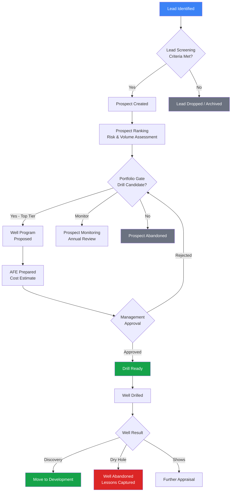

**UI Page**: Prospect Maturation Board (Kanban)  
**Columns**: Lead | Screening | Prospect | Ranking | Drill Candidate | Well Program | Approved | Drilled  
**Key Actions**: Advance Stage, Drop Prospect, Request AFE, Record Well Result

---

### 2.2 Seismic Survey Process

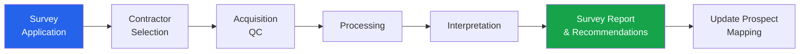

**UI Page**: Seismic Survey Tracker  
**Key Actions**: Submit application, Track progress, Upload interpreted horizons, Link to prospects

---

### 2.3 Exploration Well Program Approval

Multi-level gate review before spending on exploratory drilling.

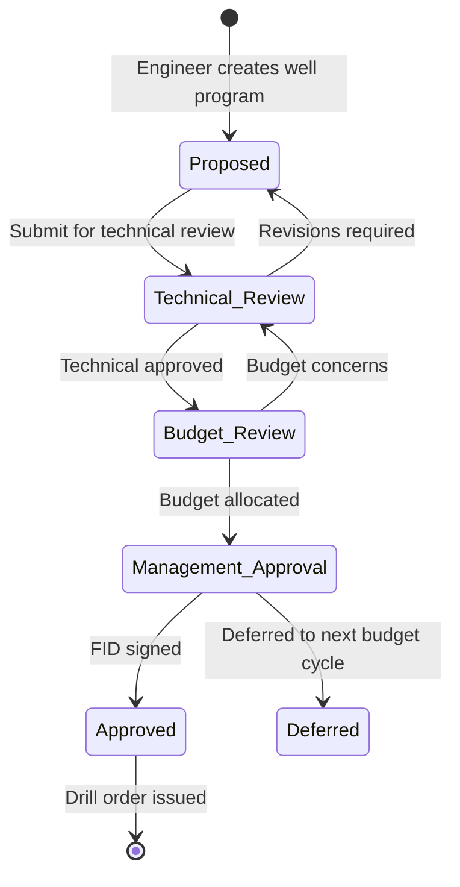

**UI Page**: Well Program Approval Wizard (5 Steps)  
**Steps**: 1. Well Objectives → 2. Technical Summary → 3. Risk Assessment → 4. Cost Estimate (AFE) → 5. Approval Sign-off

---

## Part 3: Development Phase Business Processes

### 3.1 Field Development Plan (FDP) Process

The FDP is the masterplan for bringing a discovery into production.

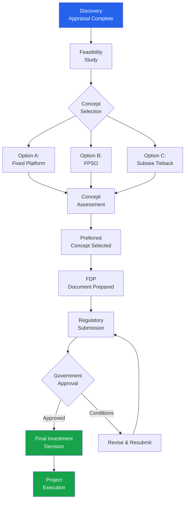

**UI Page**: FDP Wizard (5 steps) + FDP Document Viewer  
**Key Actions**: Submit concept options, Record concept selection, Submit to regulator, Record approval, Issue FID

---

### 3.2 Development Well Design Workflow

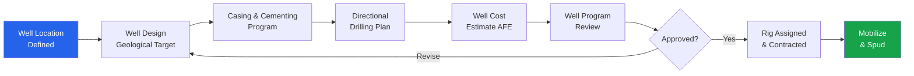

**UI Page**: Development Well Design Workflow  
**Key Forms**: Well location picker (map), Casing design table, AFE builder, Rig selection

---

### 3.3 Construction Progress Tracking

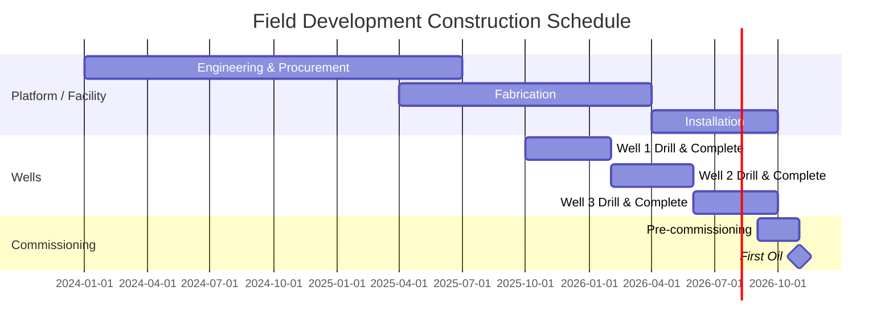

**UI Page**: Project Progress Dashboard  
**Shows**: Schedule vs actual, milestone tracker, cost vs budget, open punch items

---

## Part 4: Production Phase Business Processes

### 4.1 Daily Production Operations Workflow

The core production engineer's daily routine:

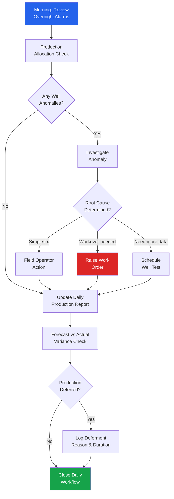

**UI Page**: Production Daily Operations Center  
**Key Widgets**: Active well status grid, alarm list, daily vs target comparison, deferment logger

---

### 4.2 Well Performance Monitoring & Optimization

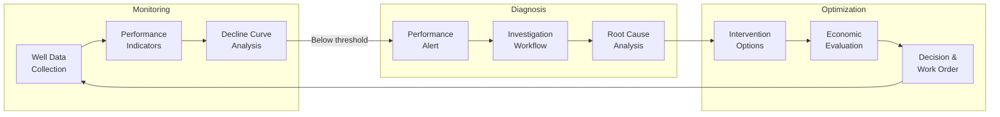

**UI Page**: Well Performance Optimizer  
**Key Features**: Multi-well comparison, decline curve overlay, intervention history, NPV-ranked recommendations

---

### 4.3 Well Intervention Decision Workflow

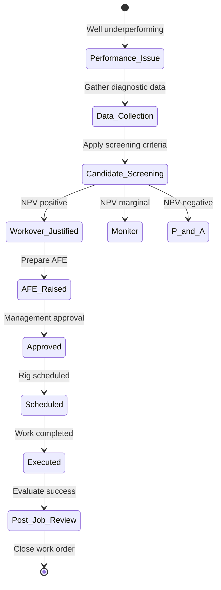

**UI Page**: Well Intervention Decision Tool  
**Key Sections**: Candidate list (ranked by NPV uplift), decision matrix, AFE builder, work order tracker

---

### 4.4 Production Allocation & Reporting

```mermaid
flowchart TD
    F[Field Production\nMeasurement] --> ME[Metering\nData Input]
    ME --> SC[Shrinkage &\nCorrections Applied]
    SC --> AL{Allocation\nMethod}
    AL --> PRO[Proportional\nAllocation]
    AL --> TEST[Well Test\nBased Allocation]
    AL --> SIM[Simulation\nBased Allocation]
    PRO & TEST & SIM --> WA[Well-Level\nAllocated Volumes]
    WA --> VLID[Validation &\nReconciliation]
    VLID --> {Balance check}
    --> REP[Monthly Production\nReport Generated]
    REP --> REG_SUB[Regulatory\nSubmission]
    REP --> REV_CALC[Revenue\nCalculation Input]
    
    style F fill:#2563eb,color:#fff
    style REP fill:#16a34a,color:#fff
    style REG_SUB fill:#16a34a,color:#fff
```

**UI Page**: Production Allocation Workbench  
**Key Features**: Metering data entry, allocation method selector, volume reconciliation check, report generator

---

### 4.5 Production Forecasting Process

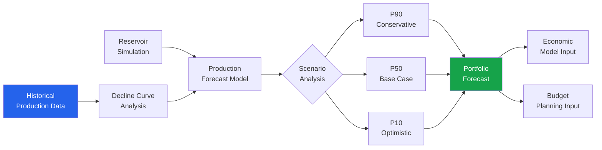

**UI Page**: Production Forecasting Workbench  
**Key Features**: DCA parameter fitting, P10/P50/P90 scenario builder, forecast chart, budget integration

---

## Part 5: Reservoir Management Processes

### 5.1 Reservoir Characterization Workflow

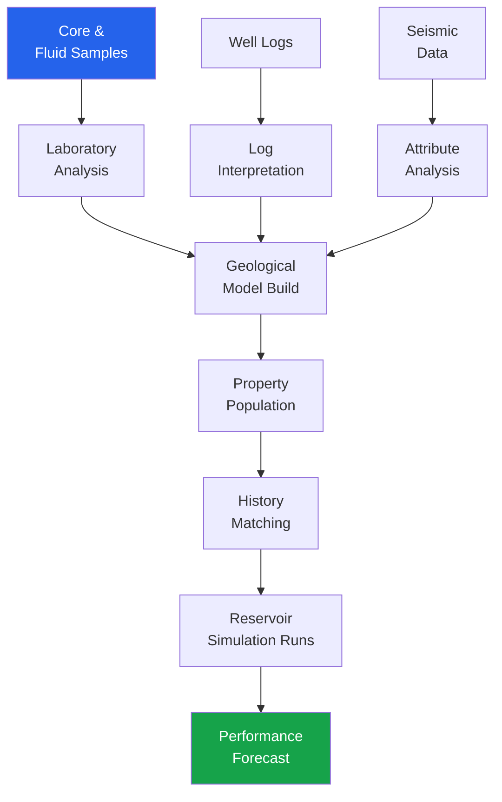

**UI Page**: Reservoir Characterization Summary  
**Key Features**: Rock & fluid property viewer, log correlation display, model status tracker

---

### 5.2 EOR (Enhanced Oil Recovery) Screening

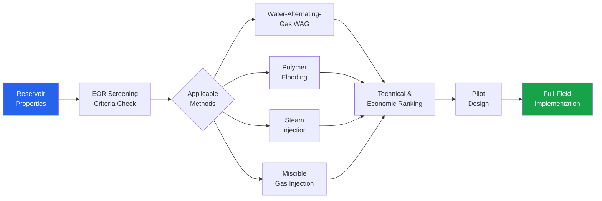

**UI Page**: EOR Screening & Evaluation Tool  
**Key Features**: Screening criteria matrix, EOR method comparison, pilot design parameters

---

### 5.3 Reserves Estimation & Classification

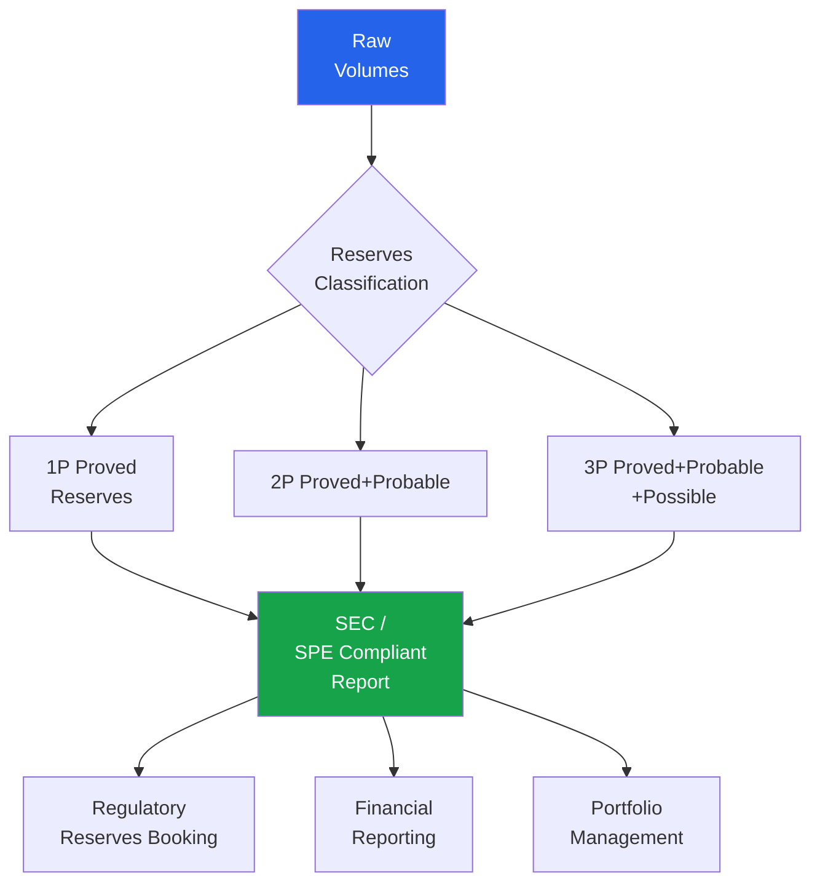

**UI Page**: Reserves Classification & Reporting  
**Key Features**: Volume entry by category, classification workflow, compliance checker, certification record

---

## Part 6: HSE & Compliance Processes

### 6.1 HSE Incident Management

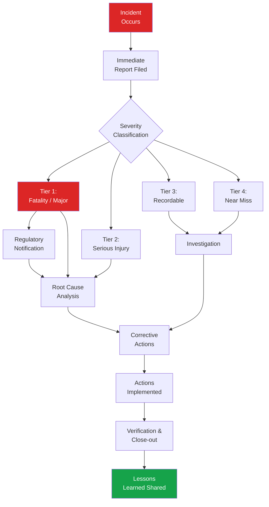

**UI Page**: HSE Incident Management  
**Key Features**: Incident report form (API RP 754 compliant), investigation tracker, corrective action log, regulatory notification

---

### 6.2 Permit & Regulatory Compliance

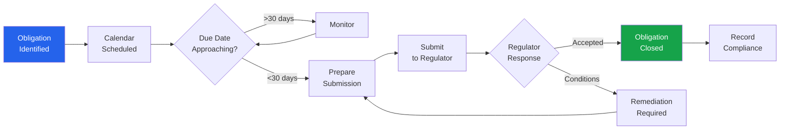

**UI Page**: Compliance Obligation Calendar  
**Key Features**: Due-date calendar, submission tracker, regulator response log, overdue alerts

---

## Part 7: Decommissioning Processes

### 7.1 Well P&A (Plug & Abandon) Workflow

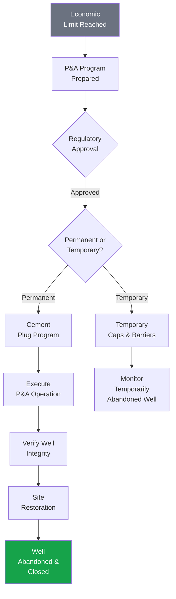

**UI Page**: Well P&A Planning & Execution  
**Key Features**: P&A candidate list, program builder, operations tracker, integrity verification, site restoration checklist

---

### 7.2 Facility Decommissioning


**UI Page**: Facility Decommissioning Tracker  
**Key Features**: Decommission plan wizard, task tracker, cost tracker, regulatory milestones, site restoration progress

---

## Part 8: Economics & Decision Support

### 8.1 AFE (Authorization for Expenditure) Process

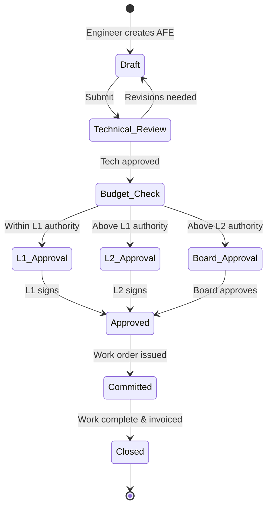

**UI Page**: AFE Management  
**Key Features**: AFE builder with cost breakdown, approval workflow, commitment tracking, actual vs. AFE variance

---

### 8.2 Economic Evaluation Process

```mermaid
flowchart TD
    INPUT[Production\nForecast + Costs] --> ECO[Economic\nModel]
    ECO --> PRICE[Price Deck\nScenarios]
    PRICE --> METRICS[NPV IRR\nPayback PI]
    METRICS --> SENS[Sensitivity\nAnalysis]
    SENS --> RISK[Risk-Adjusted\nEvaluation]
    RISK --> RANK[Project\nRanking]
    RANK --> PORT[Portfolio\nOptimization]
    
    style INPUT fill:#2563eb,color:#fff
    style PORT fill:#16a34a,color:#fff
```

**UI Page**: Economic Evaluation Workbench  
**Key Features**: Price deck input, NPV/IRR calculation, sensitivity tornado chart, scenario comparison

---

## Part 9: User Role → Process Mapping

| Role | Primary Processes | Secondary Processes |
|------|------------------|---------------------|
| Exploration Geoscientist | Prospect Maturation, Seismic Surveys | Well Program Review |
| Drilling Engineer | Well Design, AFE, P&A Planning | Construction Progress |
| Production Engineer | Daily Operations, Well Optimization, Intervention | Allocation, Reporting |
| Reservoir Engineer | Characterization, Simulation, EOR, Reserves | Forecasting |
| Development Engineer | FDP, Construction, Commissioning | Economics |
| Facilities Engineer | Facility Design, Decommissioning | Maintenance |
| HSE Officer | Incident Management, Permits | Compliance Reporting |
| Asset Manager | AFE Approvals, Gate Reviews, Portfolio | All dashboards |
| Financial Analyst | Production Accounting, Economics | Reserves Reporting |
| Data Manager | PPDM Data Management (TreeView) | Quality Checks |

---

## Part 10: Page-to-Process Mapping Matrix

| UI Page | Business Process | Stage | Priority |
|---------|-----------------|-------|----------|
| Field Dashboard | Daily status overview | All | P0 |
| Prospect Maturation Board | Prospect lifecycle | Exploration | P1 |
| Well Program Approval | Drill authorization | Exploration | P1 |
| Seismic Survey Tracker | Seismic acquisition | Exploration | P2 |
| FDP Wizard | Field development plan | Development | P1 |
| Development Well Design | Well engineering | Development | P1 |
| Construction Progress | Project execution | Development | P2 |
| Production Daily Operations | Daily monitoring | Production | P0 |
| Well Performance Optimizer | Well optimization | Production | P0 |
| Well Intervention Decision | Intervention planning | Production | P1 |
| Production Allocation Workbench | Volume allocation | Production | P1 |
| Production Forecasting Workbench | Forecasting | Production | P2 |
| Reservoir Characterization Summary | Reservoir data | Reservoir | P2 |
| EOR Screening Tool | EOR evaluation | Reservoir | P3 |
| Reserves Classification | Reserves reporting | All | P1 |
| HSE Incident Management | Safety management | All | P0 |
| Compliance Obligation Calendar | Regulatory compliance | All | P1 |
| Well P&A Workflow | Abandonment | Decommissioning | P2 |
| Facility Decommissioning Tracker | Site restoration | Decommissioning | P2 |
| AFE Management | Cost authorization | All | P1 |
| Economic Evaluation Workbench | Economics | All | P2 |
| PPDM Data Management (TreeView) | Data administration | All | P0* |

*P0 = Data management priority (separate from engineer UX)

---

*This document is the authoritative reference for UI business process design. Engineers should recognize their daily work in these process flows. If a new page is proposed that does not map to a process in this document, the process must be added here first.*
