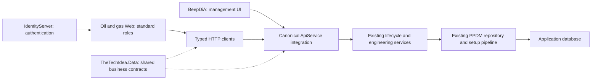

# Architecture decisions and plan alignment

## Governing boundary

Confirmed by the user on 2026-09-21: **RBAC belongs to the oil and gas application itself. IdentityServer is used only for user authentication.** The app's roles, assignments, permissions, field access and authorization decisions are not sourced from IdentityServer. This is a settled requirement, not an open architecture decision under FG-01.

The user-supplied `AGENTS.md` is authoritative: client-facing database access belongs to the canonical ApiService; TheTechIdea.Data owns shared business contracts; IdentityServer authenticates; client applications use app-owned roles through standard ASP.NET Core authorization; APIs enforce their own access independently; BeepDiA owns core operational admin workflows.

The API is the data gateway to the app's authoritative RBAC tables and enforces its endpoints. That does not transfer ownership of the app's RBAC to IdentityServer or introduce a separate API-owned role system. Web calls the gateway instead of reading RBAC tables directly, then synthesizes standard role claims from that response. IdentityServer token role claims, if encountered, cannot grant application access.

After reconciling remote master `c6754410`, this checkout contains Beep.OilandGas.Repository and TheTechIdea.Data identity/persona contracts alongside Beep.OilandGas.ApiService and Beep/PPDM/module model projects. Repository-owned ASP.NET Identity is the app RBAC authority; reuse its existing API/Web bridges. Do not silently treat those names as aliases for the named platform projects, and do not create substitute projects to make the documents appear aligned. FG-01 must record how the oil-and-gas API is hosted/integrated into the canonical gateway, how existing contracts are reused or migrated into TheTechIdea.Data, and how the external BeepDiA consumes management endpoints. No new shared business model should be added to a competing owner while that mapping is unresolved.

Preserve the PPDM generated schema as a standard schema input. Inventory existing extension tables, DTOs and serialization consumers before moving ownership. A contract relocation is one migration with one owner, not a copied model tree. Retire old internal implementations when consumers switch. Update development consumers with the canonical route and contract; do not preserve retired routes through compatibility copies.

## Development refactor policy

Confirmed by the user on 2026-09-21: this product is in development and has no legacy compatibility requirement. Implement the best target structure directly. Refactor or replace internal and client-facing contracts together, update all repository consumers, and remove obsolete endpoints, DTOs, save methods and duplicate implementations when replacements are ready. Do not add compatibility shims, fallback business values, parallel stores or versioned copies solely to preserve the old development design.

The user delegates routine architectural choices and authorizes research where useful. Apply established practices with repository evidence; do not repeatedly ask the user to choose implementation details. Record meaningful decisions and limitations in the master tracker. This authorization does not turn unverified source into a completed release gate.

For accounting: preview is read-only, posting is an explicit audited state transition, and reporting reads recorded transactions. Use one calculation path for preview and posting. Financial inputs must be recorded and traceable; missing/ambiguous inputs fail explicitly. Posting must have database-enforced idempotency and transaction/recovery guarantees before release. No assumed royalty rates, prices, tax deductions or silently substituted commercial terms.

## Target flow

The diagram is the intended boundary, not a claim that external integration already exists. Calculators remain reusable domain libraries. Their persistence and client-facing orchestration stay behind the API. Pure rendering helpers may remain in Web; database access libraries must not be introduced there as a convenience.

## Reuse existing plans

| Existing plan | Relationship to this review |
|---|---|
| [Facility management](../FacilityManagementPlan.md), [facility phase 1](../Phases/ProductionOperations-Facility-Phase1-Services.md), [facility phase 2](../Phases/ProductionOperations-Facility-Phase2-API-Verification.md) | Retain implementation detail; FG-22 closes persistence/HTTP evidence. Do not create another facility service. |
| [Module setup](../module-setup-phase-plan/00_Master_Phased_Plan.md), [database wizard tracker](../DataBaseWizardandCreationEnhancment/MASTER-TODO-TRACKER.md) | Reuse discovery/setup and wizard flows; FG-20/21 add reproducibility and recovery gates. |
| [Domain module revision](../domain-module-revision-plan.md) | Reconcile interface/registration tasks with actual source before implementing them again. |
| [Calculation roadmap](../ENHANCEMENT_ROADMAP.md) and module enhancement plans | Historical feature candidates; FG-30/31 use existing implementations and demand units, provenance and benchmark evidence. |
| [Workflow/RBAC master plan](../workflow-rbac-master-plan.md) and its five phase documents | Existing engine and governance work are inputs. FG-11 supersedes any conflicting custom role mechanism; FG-40 verifies durable workflow execution. |
| [Accounting revision](../accounting-revision-master-plan.md), [accounting standards](../accounting-standards-enhancement-plan.md) | Preserve service boundaries and standard-specific detail; FG-41 validates close/reopen and reconciliations before extending scope. |
| [UI/UX guidelines](../UI-UX-OilAndGas-Guidelines.md), [Web architecture](../Architecture/WEB_ARCHITECTURE_PLAN.md) | Use for journey detail subject to AGENTS.md branding and one-file CSS/JS rules. |

## Duplication controls

Before each task, locate the existing service, interface, DTO, module registration, endpoint, client and page. Record the chosen owner in the change. Extend that chain. Do not introduce a second workflow engine, calculation persistence store, role system, setup orchestrator or notification hub. Consolidate parallel client paths as their consumers migrate. Feature trackers retain detailed local checklists; the root tracker owns cross-project priority and release status.

Before code changes, load the applicable AGENTS.md skills. The referenced `.github/Skills` directory was not present during this review; locate the corresponding skill before implementation and document any unresolved prerequisite. This documentation-only review did not modify those code areas.
